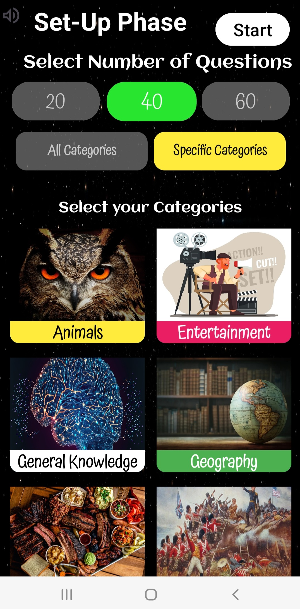
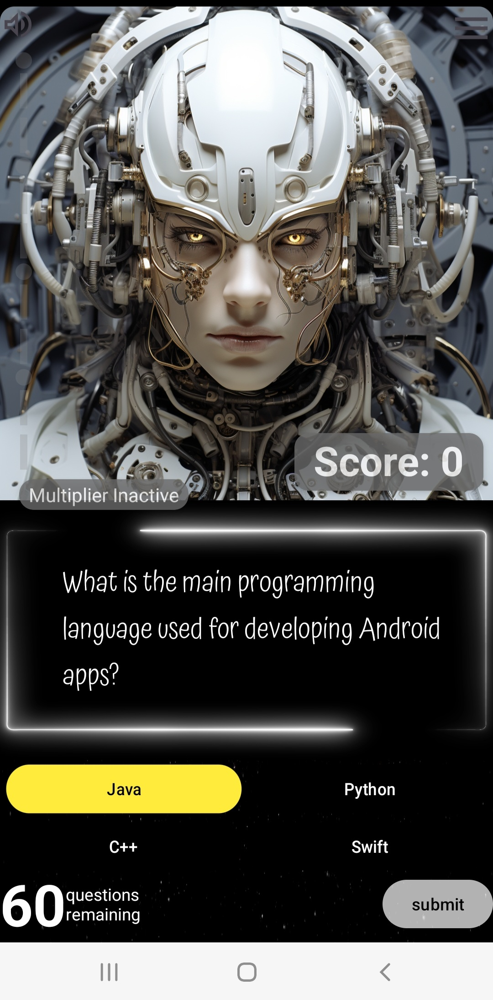

# Android_App_Trivia_Game
A trivia game developed for Android mobile devices. Developed using Android Studio, written primarily in Java.

  
  
  

## To run
Clone repository into Android studio and build. Run on either emulator or physical android device.

## Existing Features
Questions available from 10 categories, in total over 1000 questions so far. Players can choose their combination of categories as well as the number of questions for each game.

Multipliers are activated in game when questions are consecutively answered correctly. Answering a question incorrectly breaks the multiplier and it reverts to 0. 

## Features that will later be added.

Highscore system.

Personal profile configuration.

Multiplayer.

